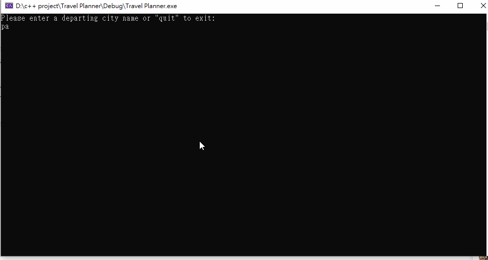

# CS301-Travel-Planner

This is a traveling planner program, user can select a starting city A and a destination city B, the program will generate a closest path from A to B using BFS. All the city connections are from sample document "connections.txt".

### App Walkthough GIF

GIF created with [LiceCap](http://www.cockos.com/licecap/).
